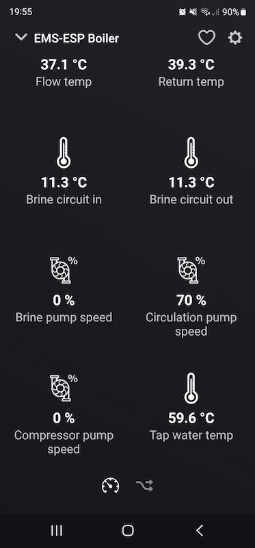

# Homey Pro app for EMS-ESP

Original code from https://github.com/angas/se.assermark.ems-esp
Change for my devices

Adds thermostat and boiler support for the Homey Pro in a simplistic manner. Use it for inspiration and as a launch pad for your own project.

Communication with EMS-ESP is done via HTTP/REST.

# Getting Started

Install the [Homey CLI](https://apps.developer.homey.app/the-basics/getting-started#1.-install-homey-cli) then run the following [command](https://apps.developer.homey.app/the-basics/getting-started#3.-run-the-homey-app) to start the Homey app on your device of choice.

```
homey app run
```

## Tested on

- Homey Pro (early 2023)
- Buderus GB072 thermostat RC25

## Implemented entities

### Thermostat

- target_temperature (read/write)
- night_temperature (read/write)
- day_temperature (read/write)

### Boiler

- curflowtemp (read)
- lastcode (read)
- wwcurtemp (read)


